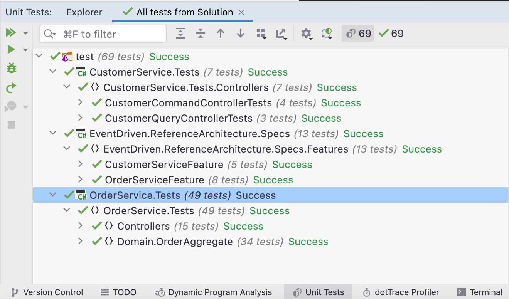
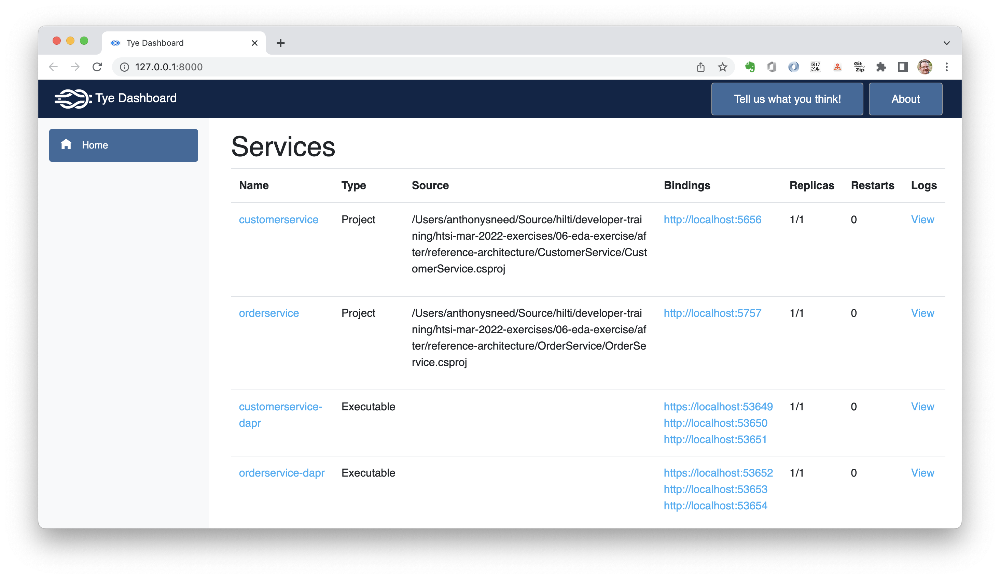
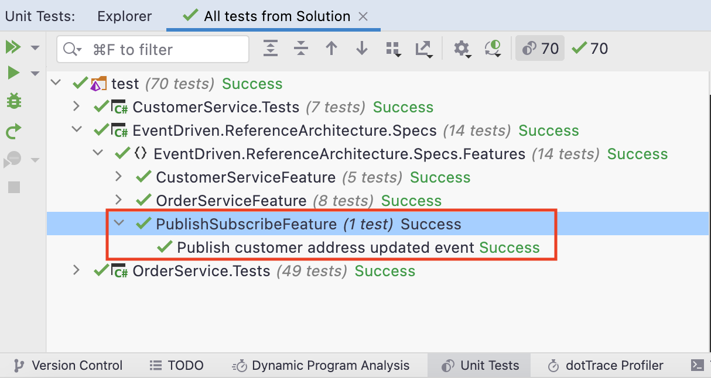
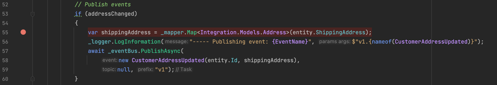
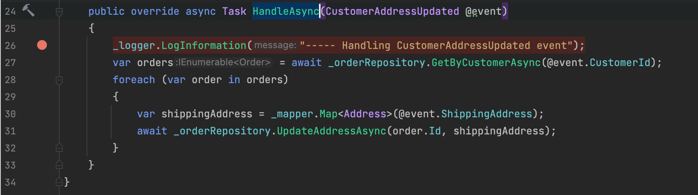
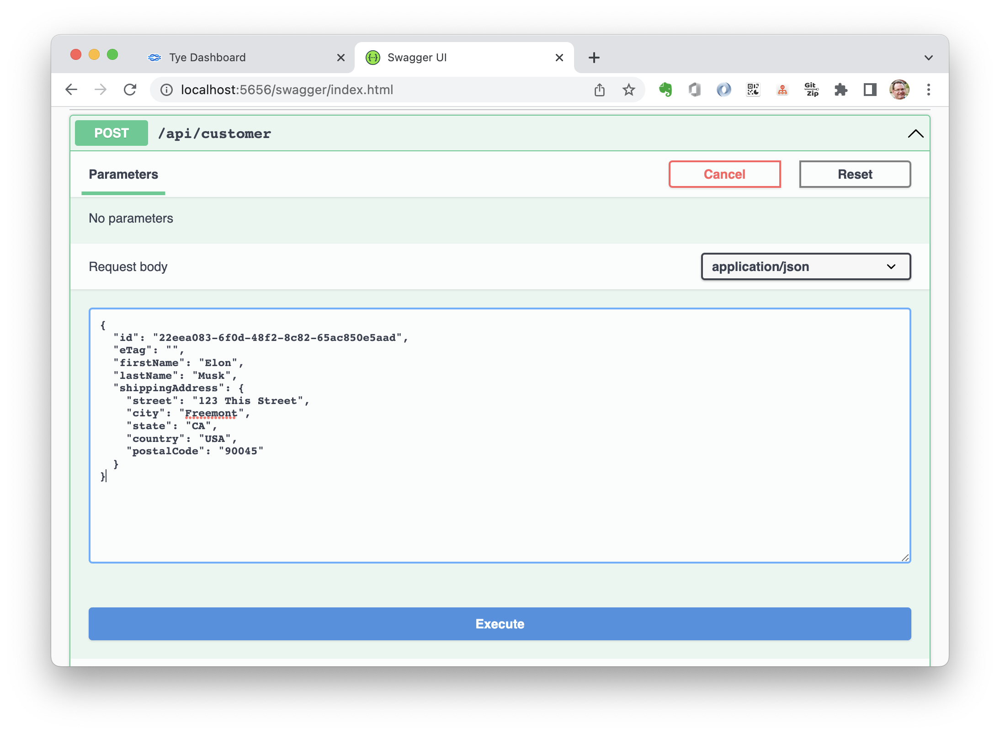
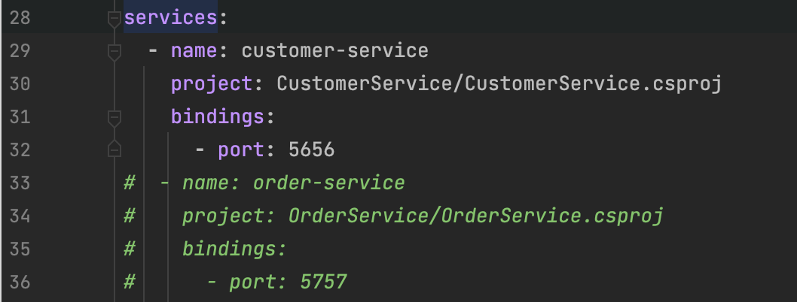
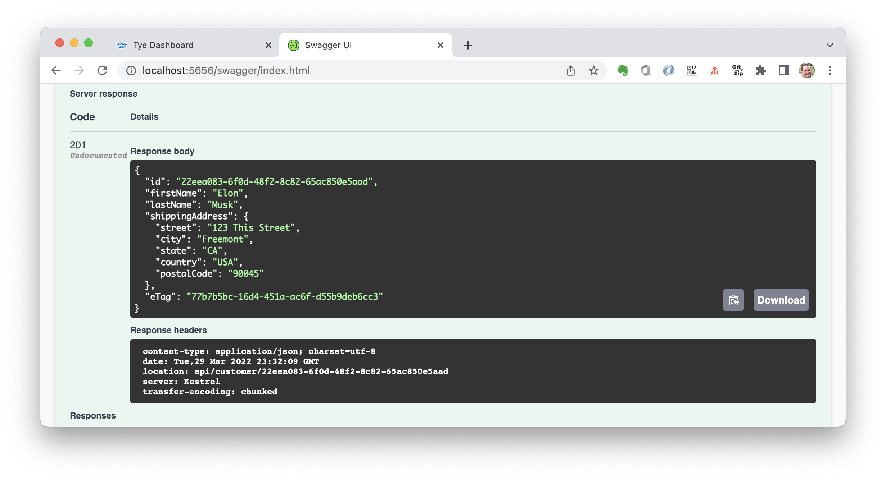
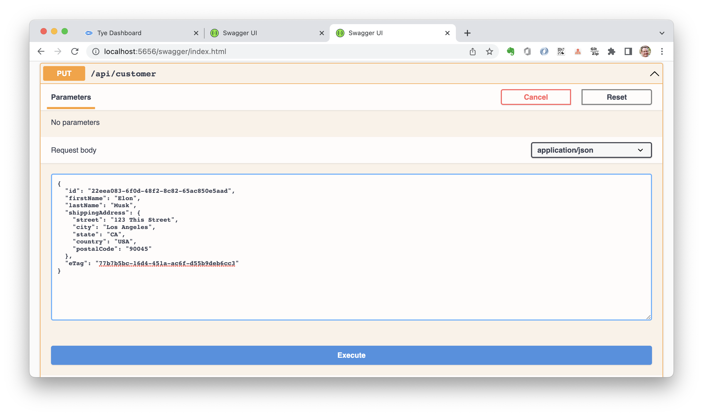

# Event Driven Microservices with Dapr Exercise

Use [Dapr](https://dapr.io/) with an [event bus](https://github.com/event-driven-dotnet/EventDriven.EventBus.Dapr) to enable pub/sub with asynchronous communication between services.

### Prerequisites
- [.NET Core SDK](https://dotnet.microsoft.com/download) (6.0 or greater)
- [Docker Desktop](https://www.docker.com/products/docker-desktop)
- MongoDB Docker: `docker run --name mongo -d -p 27017:27017 -v /tmp/mongo/data:/data/db mongo`
- [MongoDB Client](https://robomongo.org/download):
  - Download Robo 3T only.
  - Add connection to localhost on port 27017.
- [Dapr](https://dapr.io/) (Distributed Application Runtime)
  - [Install Dapr CLI](https://docs.dapr.io/getting-started/install-dapr-cli/)
  - [Initialize Dapr](https://docs.dapr.io/getting-started/install-dapr-selfhost/)
- [Microsoft Tye](https://github.com/dotnet/tye/blob/main/docs/getting_started.md)
- [Specflow](https://specflow.org/) IDE Plugin for either:
  - [Visual Studio](https://docs.specflow.org/projects/getting-started/en/latest/GettingStarted/Step1.html)
  - [JetBrains Rider](https://docs.specflow.org/projects/specflow/en/latest/Rider/rider-installation.html)

## Steps

*Your task will be to refactor the code to implement EDA by publishing and handling integration events using the Dapr Event Bus.*

1. Build the **before** solution.
   - Open **eda-before.sln** in Rider (or an IDE of your choice).
   - Build the solution.
2. Run user acceptance tests with **Tye** and **SpecFlow**.
   >**Note**: While it is possible to run each service directly from the IDE, Tye sets **environment variables** which point to test databases that are populated by the `Hooks` class. You can then set breakpoints and debug source code by attaching to service processes.
   - Run Tye from a terminal at the **test/EventDriven.ReferenceArchitecture.Specs** directory.
    ```bash
    cd test/EventDriven.ReferenceArchitecture.Specs
    tye run
    ```
   - Open http://localhost:8000/
     - Make sure both CustomerService and OrderService are running.
   - Open the test explorer and run all the tests.
     - *The tests should all pass.*

1. In **EventDriven.ReferenceArchitecture.Specs** add a **SpecFlow Feature File** named `PublishSubscribe` to the **Features** directory.
   - Add the `@notParallel` tag.
   - Add a scenario called `Publish customer address updated event` with the following statements.
    ```
    @notParallel
    Feature: Publish Subscribe
      Data propagation between services over an event bus abstraction layer.

    Scenario: Publish customer address updated event
      Given a customer has been created with 'customer-pubsub.json'
      And orders have been created with 'orders-pubsub.json'
      When I make a PUT request for 'Customer' with 'updated-customer-pubsub.json' to 'api/customer'
      Then the response status code should be '200'
      And the address for orders should equal 'updated-address-pubsub.json'
    ```
   - Build the `Specs` project, then run the `PublishSubscribeFeature` test.
     - *The test should fail.*
   - Press Ctrl+C to terminate Tye.
2. Add these NuGet packages for **CustomerService**.
   - **EventDriven.EventBus.Dapr**
   - **EventDriven.EventBus.Dapr.EventCache.Mongo**
   - Build the solution.
3. In **Common** add integration events and models.
   - In **Common/Integration/Models** add an `Address` record.
    ```csharp
    public record Address(string Street, string City, string State, string Country, string PostalCode);
    ```
    - In **Common/Integration/Events** add a `CustomerAddressUpdated` record.
    ```csharp
    public record CustomerAddressUpdated(Guid CustomerId, Address ShippingAddress) : IntegrationEvent;
    ```
4. In **CustomerService** update `AutoMapperProfile`.
   - Add `Integration` namespace alias for `Common.Integration.Models`.
    ```csharp
    // Add Integration namespace alias
    using Integration = Common.Integration.Models;
    ```
   - Create mappings for the integration `Address` model.
    ```csharp
    CreateMap<Address, Integration.Address>();
    CreateMap<Address, Integration.Address>().ReverseMap();
    ```
5. In **CustomerService** edit `UpdateCustomerHandler` in **Domain/CustomerAggregate/CommandHandler** so that it publishes an event to the event bus whenever a customer address is updated.
   - Add `Integration` namespace alias for `Common.Integration`.
    ```csharp
    // Add Integration namespace alias
    using Integration = Common.Integration;
    ```
   - Update the ctor to accept `IEventBus`, `IMapper`, `ILogger<UpdateCustomerHandler>`.
    ```csharp
    private readonly ICustomerRepository _repository;
    private readonly IEventBus _eventBus;
    private readonly IMapper _mapper;
    private readonly ILogger<UpdateCustomerHandler> _logger;

    public UpdateCustomerHandler(
        ICustomerRepository repository,
        IEventBus eventBus,
        IMapper mapper,
        ILogger<UpdateCustomerHandler> logger)
    {
        _repository = repository;
        _eventBus = eventBus;
        _mapper = mapper;
        _logger = logger;
    }
    ```
    - Update the `Handle` method to compare shipping addresses.
    ```csharp
    // Compare shipping addresses
    var existing = await _repository.GetAsync(command.EntityId);
    if (existing == null) return new CommandResult<Customer>(CommandOutcome.NotHandled);
    var addressChanged = command.Entity.ShippingAddress != existing.ShippingAddress;
    ```
   - Update an event if the address has changed.
    ```csharp
    // Publish events
    if (addressChanged)
    {
        var shippingAddress = _mapper.Map<Integration.Models.Address>(entity.ShippingAddress);
        _logger.LogInformation("----- Publishing event: {EventName}", $"v1.{nameof(CustomerAddressUpdated)}");
        await _eventBus.PublishAsync(
            new CustomerAddressUpdated(entity.Id, shippingAddress),
            null, "v1");
    }
    ```
6. In **CustomerService** update `Program` to add a logging behavior and register Dapr Event Bus with dependency injection.
   - Have a look at `LoggingBehavior` in **Common/Behaviors** to see how it logs information both before and after a command or query handler has handled a command or query.
     - This is a feature of **MediatR** which supports cross-cutting concerns across handlers.
   - Edit `Program` to add the logging behavior to dependency injection.
    ```csharp
    // Add behaviors
    builder.Services.AddTransient(typeof(IPipelineBehavior<,>), typeof(LoggingBehavior<,>));
    ```
   - Next add Dapr Event Bus to dependency injection.
    ```csharp
    // Add Dapr event bus
    builder.Services.AddDaprEventBus(builder.Configuration, true);
    builder.Services.AddDaprMongoEventCache(builder.Configuration);
    ```
   - Add the sections following to **appsettings.json**.
     - `DaprEventBusOptions` specifies the Dapr pubsub component name.
     - `DaprEventCacheOptions` specifies the `StateStoreName` for the Dapr event cache store.
     - `DaprStoreDatabaseSettings` specifies the database settings for the event cache store.
     - `DaprEventBusSchemaOptions` specifies various options for the Dapr Event Bus schema registry.
   ```json
   "DaprEventBusOptions": {
     "PubSubName": "pubsub"
   },
   "DaprEventCacheOptions": {
     "DaprStateStoreOptions": {
       "StateStoreName": "statestore-mongodb"
     }
   },
   "DaprStoreDatabaseSettings": {
     "ConnectionString": "mongodb://localhost:27017",
     "DatabaseName": "daprStore",
     "CollectionName": "daprCollection"
   },
   "DaprEventBusSchemaOptions": {
     "UseSchemaRegistry": true,
     "SchemaValidatorType": "Json",
     "SchemaRegistryType": "Mongo",
     "AddSchemaOnPublish": true,
     "MongoStateStoreOptions": {
       "ConnectionString": "mongodb://localhost:27017",
       "DatabaseName": "schema-registry",
       "SchemasCollectionName": "schemas"
     }
   }
   ```
7.  In **OrderService** update `AutoMapperProfile`.
    - Add `Address` and `Integration` namespace aliases.
    ```csharp
    // Add Address and Integration aliases
    using Address = OrderService.Domain.OrderAggregate.Address;
    using IntegrationAddress = Common.Integration.Models.Address;
    ```
    - Create mappings for the integration `Address` model.
    ```csharp
    // Create Integration mappings
    CreateMap<Address, IntegrationAddress>();
    CreateMap<Address, IntegrationAddress>().ReverseMap();
    ```
8.  In **OrderService** add an integration event handler to update orders when a customer address has changed in the Customer Service.
    - Add a `CustomerAddressUpdatedEventHandler` class to the **Integration/EventHandlers** folder.
    - Extend `IntegrationEventHandler<CustomerAddressUpdated>`.
    - Add a ctor that accepts `IOrderRepository`, `IMapper`, `ILogger<CustomerAddressUpdatedEventHandler>`.
    - Override `HandleAsync` and use the order repository to retrieve customer orders.
    - Then update the shipping address for each order, mapping `@event.ShippingAddress` to a domain `Address`.
    ```csharp
    public class CustomerAddressUpdatedEventHandler : IntegrationEventHandler<CustomerAddressUpdated>
    {
        private readonly IOrderRepository _orderRepository;
        private readonly IMapper _mapper;
        private readonly ILogger<CustomerAddressUpdatedEventHandler> _logger;

        public CustomerAddressUpdatedEventHandler(IOrderRepository orderRepository,
            IMapper mapper,
            ILogger<CustomerAddressUpdatedEventHandler> logger)
        {
            _orderRepository = orderRepository;
            _mapper = mapper;
            _logger = logger;
        }

        public override async Task HandleAsync(CustomerAddressUpdated @event)
        {
            _logger.LogInformation("----- Handling CustomerAddressUpdated event");
            var orders = await _orderRepository.GetByCustomerAsync(@event.CustomerId);
            foreach (var order in orders)
            {
                var shippingAddress = _mapper.Map<Address>(@event.ShippingAddress);
                await _orderRepository.UpdateAddressAsync(order.Id, shippingAddress);
            }
        }
    }
    ```
9.  In **OrderService** update `Program` to register Dapr Event Bus with dependency injection and map subscribers to handle integration events.
    - Add event handlers.
    ```csharp
    // Add event handlers
    builder.Services.AddSingleton<CustomerAddressUpdatedEventHandler>();
    ```
    - Add Dapr event bus.
    ```csharp
    // Add Dapr event bus
    builder.Services.AddDaprEventBus(builder.Configuration, true);
    builder.Services.AddDaprMongoEventCache(builder.Configuration);
    ```
    - Use Cloud Events for Dapr Pub-Sub.
    ```csharp
    // Use Cloud Events for Dapr Pub-Sub
    app.UseCloudEvents();
    ```
    - Map Dapr Event Bus subscribers to handle integration events.
    ```csharp
    // Map Dapr Event Bus subscribers
    endpoints.MapSubscribeHandler();
    endpoints.MapDaprEventBus(eventBus =>
    {
        var customerAddressUpdatedEventHandler = app.Services.GetRequiredService<CustomerAddressUpdatedEventHandler>();
        eventBus.Subscribe(customerAddressUpdatedEventHandler, null, "v1");
    });
    ```
10. In **OrderService** add the sections following to **appsettings.json**.
     - `DaprEventBusOptions` specifies the Dapr pubsub component name.
     - `DaprEventCacheOptions` specifies the `StateStoreName` for the Dapr event cache store.
     - `DaprStoreDatabaseSettings` specifies the database settings for the event cache store.
     - `DaprEventBusSchemaOptions` specifies various options for the Dapr Event Bus schema registry.
    ```json
    "DaprEventBusOptions": {
      "PubSubName": "pubsub"
    },
    "DaprEventCacheOptions": {
      "DaprStateStoreOptions": {
        "StateStoreName": "statestore-mongodb"
      }
    },
    "DaprStoreDatabaseSettings": {
      "ConnectionString": "mongodb://localhost:27017",
      "DatabaseName": "daprStore",
      "CollectionName": "daprCollection"
    },
    "DaprEventBusSchemaOptions": {
      "UseSchemaRegistry": true,
      "SchemaValidatorType": "Json",
      "SchemaRegistryType": "Mongo",
      "AddSchemaOnPublish": true,
      "MongoStateStoreOptions": {
        "ConnectionString": "mongodb://localhost:27017",
        "DatabaseName": "schema-registry",
        "SchemasCollectionName": "schemas"
      }
    }
    ```
13. Enable Dapr for the SpecFlow acceptance tests.
    - Open **tye.yaml** at the **EventDriven.ReferenceArchitecture.Specs** project root.
      - Uncomment the `extensions` section to add the Dapr extension with a `components-path`.
    ```yaml
    # dapr
    extensions:
      - name: dapr
        log-level: debug
        components-path: "../../reference-architecture/dapr/components"
    ```
    - Execute `tye run` at the `Specs` project root.
      - Open http://localhost:8000 to verify services are up and running with Dapr sidecars.

14. Run the acceptance tests.
    - Run the **PublishSubscribeFeature** acceptance test.
      - *The test should now pass.*

    - Press Ctrl+C to terminate Tye.

### Debugging

1. Debug **CustomerService** and **OrderService** to observe publishing and handling of integration events.
    - In **CustomerService** open `UpdateCustomerHandler` in **Domain/CustomerAggregate/CommandHandlers** and set a breakpoint on `line 55` in the `Handle` method.

    - In **OrderService** open `CustomerAddressUpdatedEventHandler` in **Integration/EventHandlers** and set a breakpoint on `line 26` in the `HandleAsync` method.

2. From a terminal at **reference-architecture** execute `tye run`.
      - Go to http://localhost:5656/swagger
      - Execute POST with the following JSON.
      ```json
      {
        "id": "22eea083-6f0d-48f2-8c82-65ac850e5aad",
        "eTag": "",
        "firstName": "Elon",
        "lastName": "Musk",
        "shippingAddress": {
          "street": "123 This Street",
          "city": "Freemont",
          "state": "CA",
          "country": "USA",
          "postalCode": "90045"
        }
      }
      ```
    
  3. Go to http://localhost:5757/swagger and execute a POST request with the following JSON.
      ```json
      {
        "id": "3fa85f64-5717-4562-b3fc-2c963f66afa6",
        "customerId": "22eea083-6f0d-48f2-8c82-65ac850e5aad",
        "orderDate": "2021-04-15T22:54:44.485Z",
        "orderItems": [
          {
            "productId": "3fa85f64-5717-4562-b3fc-2c963f66afa6",
            "productName": "Espresso",
            "productPrice": 2.50
          },
          {
            "productId": "5a8c5f7f-0781-4d5e-9d9b-41ef2da5f3c3",
            "productName": "Cappuccino",
            "productPrice": 3.50
          }
        ],
        "shippingAddress": {
          "street": "123 This Street",
          "city": "Freemont",
          "state": "CA",
          "country": "USA",
          "postalCode": "90045"
        },
        "orderState": 0,
        "eTag": ""
      }
      ```
  - Execute another POST request with the following JSON.
    ```json
    {
      "id": "fd06384d-24cd-4a7f-a5f5-b05ec683bfdd",
      "customerId": "22eea083-6f0d-48f2-8c82-65ac850e5aad",
      "orderDate": "2021-04-15T22:54:44.485Z",
      "orderItems": [
        {
          "productId": "42b27777-6eff-4193-828d-5fe554a705d1",
          "productName": "Chai",
          "productPrice": 1.50
        }
      ],
      "shippingAddress": {
        "street": "123 This Street",
        "city": "Freemont",
        "state": "CA",
        "country": "USA",
        "postalCode": "90045"
      },
      "orderState": 0,
      "eTag": ""
    }
    ```
4. Edit **tye.yaml** at the **reference-architecture** directory to comment out the `orderservice` section.
  
   - This will allow you to run and debug just the publish side.
     - Because Dapr is queuing events published to the event bus, we can run CustomerService and OrderService separately.
   - Press Ctrl+C to stop Tye, then execute `tye run` to restart.
   - From the Rider **Run** menu, select **Attach to Process**.
     - Select the process fo `CustomerService.dll`.
5. Go back to the result of the customer POST and copy the `201` response body.
  
   - Now execute a PUT request, pasting the result of the POST request and changing the `city` to `Los Angeles`.
   
6. Now it's time to run OrderService to handle the address changes integration event.
   - Stop the debugger, then stop Tye with Ctrl+C.
   - Next edit **tye.yaml** to uncomment `orderservice`.
   - Run `tye run` again.
   - Attach to the `OrderService.dll` process.
   - Update the customer address again, changing the value for `city`.
     - You should hit the breakpoint in `CustomerAddressUpdatedEventHandler`.
     - Step through the code and continue execution.
